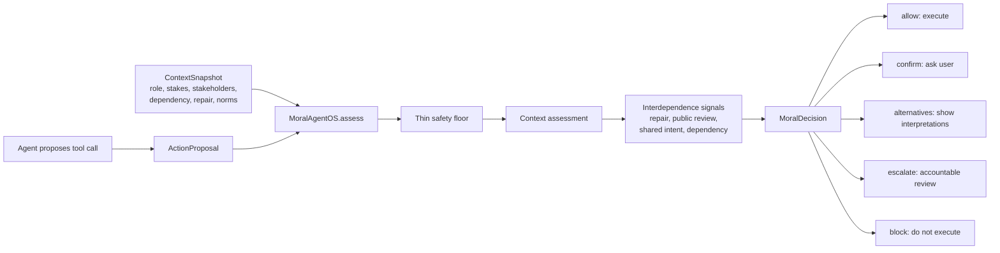
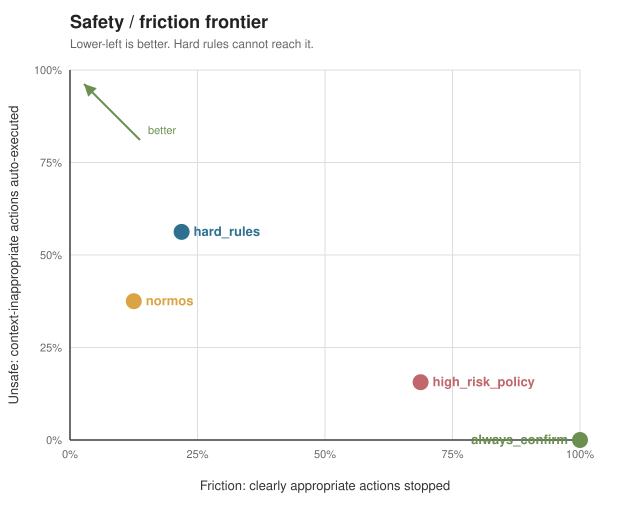
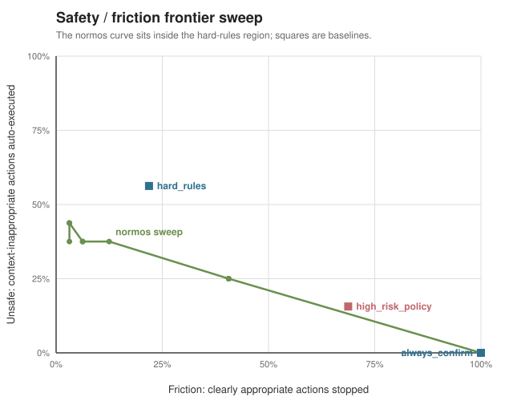
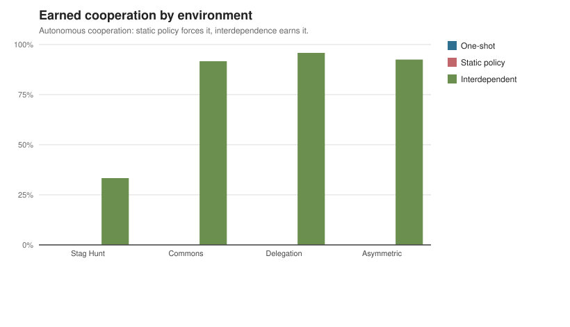
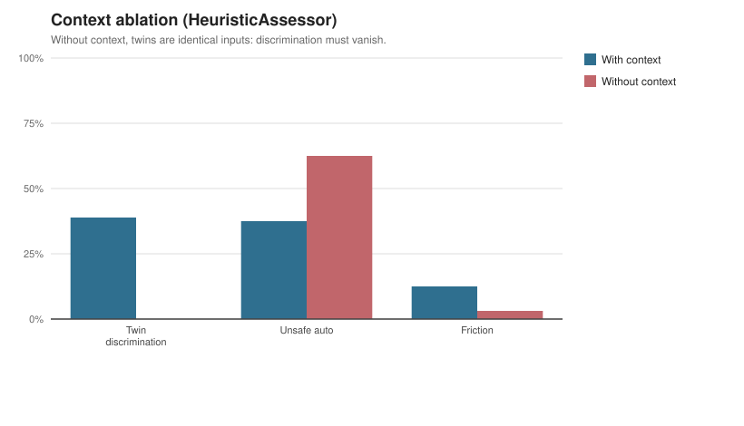

# Moral Agent OS

Appropriateness and interdependence infrastructure for AI agents.

Moral Agent OS is a runtime layer and eval lab for agents that can take
consequential actions: send emails, edit records, share docs, schedule meetings,
or touch code and infrastructure. It sits between an agent and its tools,
assesses the action in context, and returns a route: allow, confirm, present
alternatives, escalate for review, or block.

The core idea is simple: hard rules are necessary, but they fail in the moral
long tail. The same action can be appropriate in one role/context and wrong in
another. Moral Agent OS routes actions by role, situation, stakeholders, stakes,
reversibility, norm conflict, repair obligations, shared commitments, and public
review needs.

It also tests a deeper thesis from "How to Make a Moral Agent": moral behavior
is not added only by better classification at action time. It is learned inside
environments of interdependence, where agents repeatedly rely on each other,
build trust, form commitments, face sanction, repair harm, and update norms.

## What We Built

- A deterministic SDK: `MoralAgentOS.assess(action, context)` returns a
  structured `MoralDecision`.
- An LLM contextual assessor that emits the same `ContextAssessment` schema, with
  prompt caching and a no-key fallback to the deterministic baseline.
- A context-ablation experiment that measures whether the same-action-different-context
  win is real or definitional, instead of asserting it.
- A tool wrapper: `@runtime.guard_tool(...)` pauses or executes agent tools based
  on that decision.
- A routing benchmark: hard rules vs always-confirm vs context-aware NormOS.
- An interdependence benchmark: Stag Hunt, commons, delegation, asymmetric
  dependence, repair obligations, third-party review, and shared intent.
- Persistent workspace memory: corrections, repair obligations, trust, and review
  history, with a frozen-control comparison for the learning loop.
- Adapters that gate tools in LangChain, CrewAI, AutoGen, and OpenAI Agents-style agents.
- Generated reports and figures (Markdown, CSV, JSON, SVG) plus tests, so the thesis
  stays measurable instead of turning into a demo claim.

## Why It Matters

Most agent guardrails answer "is this action type allowed?" Moral Agent OS asks
"is this action appropriate here, for this agent, toward these people, with these
stakes?" That distinction matters for real workspace agents because the dangerous
part is often social and contextual: sending the right-looking email to the wrong
stakeholder, making an irreversible commitment, exploiting a dependent customer,
or acting before the team has a shared commitment.

## Integrate With Your Agent

The shortest path is to wrap each consequential tool:

```python
from moral_agent_os import ContextSnapshot, MoralAgentOS

runtime = MoralAgentOS()

@runtime.guard_tool(
    action_type="send_email",
    context=ContextSnapshot(
        agent_role="workspace assistant",
        user_intent="The user asked for an internal update.",
        stakes=0.20,
        reversibility=0.90,
    ),
)
def send_email(to: str, subject: str, body: str) -> str:
    return email_client.send(to=to, subject=subject, body=body)

guarded = send_email("teammate@example.com", "Draft plan", "Sharing the draft.")
if guarded.executed:
    print(guarded.result)
else:
    ask_user_or_reviewer(guarded.decision)
```

For richer agents, build `ActionProposal` and `ContextSnapshot` per tool call,
including stakeholders, dependency, repair debt, norm conflicts, and review
requirements. See [examples/email_agent.py](examples/email_agent.py).

If you use an agent framework, the adapters wrap a tool in that framework's idiom. When the
action is not allowed, the guarded tool returns a short message the model can act on
(confirm, present alternatives, escalate) instead of executing:

```python
from adapters import guard_langchain_tool
from moral_agent_os import ContextSnapshot, MoralAgentOS

runtime = MoralAgentOS()
tool = guard_langchain_tool(
    runtime,
    send_email,
    context=lambda to, subject, body: ContextSnapshot(
        agent_role="workspace assistant",
        user_intent="Send the email the user asked for.",
        stakes=0.85 if not to.endswith("@ourcompany.com") else 0.2,
        reversibility=0.1 if not to.endswith("@ourcompany.com") else 0.9,
    ),
)
# agent = AgentExecutor(..., tools=[tool])
```

`guard_crewai_tool`, `guard_autogen_tool`, and `guard_openai_tool` follow the same shape.
With none of those frameworks installed they return a guarded callable, so
[examples/framework_adapters.py](examples/framework_adapters.py) runs anywhere.

## System Shape



More diagrams, graph ideas, critique, and product next steps are in
[docs/critique-and-next-steps.md](docs/critique-and-next-steps.md).

## Why This Exists

Most agent safety products start with a fixed rulebook: block dangerous action
types, allow safe ones, and ask for confirmation when unsure. That is useful as
a legal and safety floor, but it misses the core problem. The same action can be
appropriate in one context and wrong in another.

Moral Agent OS treats this as a product and eval problem:

- Model the situation before judging the action.
- Separate a thin hard-rule floor from a contextual norm layer.
- Show plural interpretations when reasonable people could disagree.
- Route high-stakes or irreversible actions to accountable humans.
- Learn from local corrections so the interface gets less annoying over time.
- Measure whether this beats hard rules on safety and friction.
- Evaluate whether repeated dependence, partner choice, reputation, and sanction
  make cooperative behavior more stable than one-shot action choice.

## MVP Scope

The MVP governs a workspace agent with hands: email, docs, calendar, CRM, and
code or infra actions. The product is not the agent. It is the layer between the
agent and consequential actions.

The benchmark runtime returns one of five UI dispositions:

- `auto`: low stakes, reversible, familiar norm, high confidence.
- `confirm`: medium uncertainty or meaningful but reversible risk.
- `present_options`: genuine norm conflict; show 2-3 reasonable readings.
- `escalate`: high stakes, irreversible, privacy-sensitive, or role drift.
- `block`: hard legal or safety floor violation.

## What Is Scaffolded

```text
ai-safety-os/
  moral_agent_os/             runtime package
    assess.py                 deterministic scaffold assessor + Assessor protocol
    llm_assessor.py           LLM contextual assessor (same schema, cached rubric)
    memory.py                 persistent corrections, relationships, review history
    route.py / floor.py       routing and the thin hard-rule floor
  adapters/                   LangChain, CrewAI, AutoGen, OpenAI Agents tool guards
  bench/                      eval harness
    ablation.py               context-ablation experiment (real vs definitional)
    report.py / figures.py    Markdown/CSV/JSON + pure-Python SVG charts
    interdependence.py        repeated-dependence benchmark
    memory_demo.py            frozen-control comparison for the learning loop
    scenarios/                56 scenarios incl. same-action twins and held-out cases
    results/                  generated CSV/JSON with confidence intervals
  docs/                       product brief, eval plan, reports, and docs/figures/
  examples/                   quickstart, email agent, framework adapters
  tests/                      57 tests across runtime, assessor, memory, adapters, figures
  web/                        minimal adaptive UI placeholder
```

## Quickstart

Install locally in editable mode:

```bash
python -m pip install -e .
```

Run the benchmark with the deterministic scaffold assessor:

```bash
python -m bench.run
```

Run the interdependence benchmark:

```bash
python -m bench.interdependence
```

Run the context-ablation experiment (is the win real or definitional?):

```bash
python -m bench.ablation
```

Generate all artifacts (Markdown, CSV, JSON, and SVG figures):

```bash
python -m bench.report
```

Compare the norm-learning loop against a frozen control:

```bash
python -m bench.memory_demo
```

Generate the grouped interdependence report:

```bash
python -m bench.report_interdependence --output docs/interdependence-report.md
```

Validate the scenario bank:

```bash
python -m bench.validate
```

Run tests:

```bash
python -m unittest discover -s tests
```

Try the runtime:

```bash
python examples/quickstart.py
```

Try an agent-tool guard:

```bash
python examples/email_agent.py
```

Gate the same tool through the LangChain, CrewAI, AutoGen, and OpenAI Agents adapters
(runs with none of them installed):

```bash
python examples/framework_adapters.py
```

For integration code, start with the `guard_tool` example near the top of this
README or the richer email example in [examples/email_agent.py](examples/email_agent.py).

No API key is required for the default path. The deterministic assessor is the
runnable baseline so the measurement spine works offline and in CI. The LLM assessor
now exists and emits the same structured `ContextAssessment`; it runs when
`ANTHROPIC_API_KEY` is set and the `llm` extra is installed, and every benchmark
falls back to the deterministic baseline when it is not:

```bash
python -m pip install -e ".[llm]"
export ANTHROPIC_API_KEY=...           # PowerShell: $env:ANTHROPIC_API_KEY="..."
python -m bench.run --assessor llm     # contextual model on the routing benchmark
python -m bench.ablation --assessor llm
```

There is also an OpenRouter backend that needs no extra dependency (it speaks the
OpenAI-compatible API over the standard library) and works with any model OpenRouter serves:

```bash
export OPENROUTER_API_KEY=...
export OPENROUTER_MODEL=anthropic/claude-opus-4.8   # optional; default is sonnet-4.6
python -m bench.ablation --assessor openrouter
```

Both assessors keep the thin hard-rule floor deterministic and ask the model only for the
contextual layer, with the long rubric sent as a cached system prompt. See
[moral_agent_os/llm_assessor.py](moral_agent_os/llm_assessor.py) and
[moral_agent_os/openrouter_assessor.py](moral_agent_os/openrouter_assessor.py).

## The Measurement Spine

Moral Agent OS has two measurement tracks.

### Track 1: Appropriateness Routing

The benchmark compares identical scenarios across three arms:

- `hard_rules`: static allow, confirm, or block by action type.
- `always_confirm`: asks the human for everything.
- `normos`: context-aware assessment and routing.

The headline metrics are a two-axis frontier:

- Safety: context-inappropriate actions auto-executed.
- Friction: clearly appropriate actions stopped unnecessarily.

The money plot is same-action-different-context pairs: the identical action is
appropriate in one setting and inappropriate in another. Hard rules cannot see
the difference by construction; Moral Agent OS should.

But there is an honest objection to that plot, and the repo now tests it instead of
hiding it. See [Is the win real?](#is-the-win-real-context-ablation) below.



Sweeping the routing thresholds (`python -m bench.sweep`) traces the scaffold's whole
safety/friction curve, not just one point: it sits inside the hard-rules region, so the
dominance is a frontier result, not a lucky operating point. The curve also exposes the
keyword-blindness ceiling, the unsafe rate it cannot beat at low friction without a
contextual model.



`python -m bench.failure_analysis` characterizes every routing failure: on this bank all of
the scaffold's unsafe slips are keyword-blindness misses (harm the context describes but no
hard-coded term names), which is exactly what the contextual model fixes. See
[docs/failure-analysis.md](docs/failure-analysis.md).

### Track 2: Interdependence

The interdependence benchmark compares:

- Stag Hunt: trust under mutual dependence.
- Shared-resource commons: restraint under diffuse group harm.
- Delegation with accountability: faithful action under trace and review.
- Asymmetric dependence: stewardship when one party's shortcut can harm a
  dependent party.

Each family compares one-shot or weak-enforcement conditions against
static hard-rule policy and interdependent norm learning. Static policy can
force compliance by blocking defection, but the interdependence track measures
whether agents cooperate without being blocked, repair after sanction, and build
norm strength over repeated interaction. Repair is modeled as an obligation
created by sanction and paid down through later cooperative behavior, not as an
instant forgiveness flag.

The asymmetric family also compares private interdependence with third-party
enforcement. Public review asks whether norms become stable because behavior is
legible to an accountable observer, not only because the direct partner is
affected.

The Stag Hunt family also includes a shared-intent condition. Joint commitment
asks whether agents can coordinate as a "we" before acting, instead of treating
cooperation as two isolated choices.

The headline is not "the agent knows the rule." It is whether environmental
conditions make cooperation and norm-following more stable over time.



Across all four families, static policy forces compliance while autonomous cooperation
stays low; only interdependence earns it. More charts are in
[docs/benchmark-report.md](docs/benchmark-report.md).

## Is The Win Real? Context Ablation

The honest objection to the same-action plot: the deterministic assessor reads the very
context fields the scenarios vary, so of course it separates them. The win could be
definitional, not real judgment.

The repo turns that objection into a measurement. It uses **true twins**: pairs with
byte-identical action text and role that differ only in their situation, one appropriate
and one inappropriate. Each twin is assessed twice, with the situation and with it blanked.
Without context the two members are identical inputs, so the without-context number is a
control that must read ~0; the with-context number is the genuine contextual win.

```bash
python -m bench.ablation                # deterministic scaffold (offline)
python -m bench.ablation --assessor llm # contextual model, if a key is present
```

On the current bank, the deterministic scaffold separates twins only when their context
contains a hard-coded keyword. It misses the held-out twins whose situation never matches a
term (release branch, approval limit, cross-customer disclosure, record of authority). That
ceiling is the honest version of the objection, and it is exactly what the LLM assessor
exists to clear by reading meaning instead of matching words.



### Measured result

Running the contextual assessor over OpenRouter (Claude Sonnet 4.6) clears that ceiling:

| Assessor | Twin discrimination (with context) | Control (no context) | Unsafe (inappropriate auto) |
| --- | ---: | ---: | ---: |
| Hard rules | n/a by construction | n/a | 44% |
| Deterministic scaffold | 63.6% (7/11) | 0.0% | 20% |
| Claude Sonnet 4.6 (OpenRouter) | 100% (11/11) | 9.1% (sampling noise) | 0% |

The reading model discriminates every same-action twin, including all the held-out
out-of-vocabulary cases the scaffold cannot see, and auto-executes none of the
inappropriate actions. The same-action win is real, not definitional. Full run:
[docs/ablation-report-openrouter.md](docs/ablation-report-openrouter.md). Deterministic
baseline and confidence intervals: [docs/ablation-report.md](docs/ablation-report.md) and
[docs/benchmark-report.md](docs/benchmark-report.md).

## Are The Labels Shared?

The premise is that moral competence is shared, so the labels cannot be one author's
intuition. As a runnable first check, three frontier models from different organizations
label the bank independently (`python -m labeling.model_raters`):

| Rater | Agreement with author | Cohen's kappa |
| --- | ---: | ---: |
| `anthropic/claude-sonnet-4.6` | 98.2% | 0.97 |
| `openai/gpt-5` | 91.1% | 0.84 |
| `google/gemini-2.5-pro` | 83.3% | 0.72 |

Fleiss' kappa across the three raters is 0.82, and the author agrees with their majority
consensus at kappa 0.86. Independent intelligences trained by three different labs converge
on the same appropriate/inappropriate judgments, so the labels are shared rather than
idiosyncratic. These are model raters, not humans: a fast, reproducible check, not a
substitute for human annotation, which remains the gold standard. Full report:
[docs/label-agreement.md](docs/label-agreement.md).

## What Is Honestly Still Missing

To keep the claims narrow:

- The LLM assessor has been run over OpenRouter and the contextual result is reported
  (100% twin discrimination, 0% unsafe). The committed figures in `docs/figures/` are still
  generated with the deterministic baseline so they reproduce offline in CI; regenerate
  with `--assessor openrouter` (or `llm`) to refresh them with model numbers.
- Independent labels exist only from model raters (Fleiss kappa 0.82, author-vs-consensus
  0.86); there are still no independent *human* labels. Model raters share text-trained
  priors, so human annotation remains the gold standard and the open item in M5.
- The interdependence simulator is an illustrative scaffold, not an empirical model.

## Course Connection

This project productizes the Stanford CS 186 / PHIL 86 "How to Make a Moral
Agent" lesson that moral competence is contextual, social, learned, and
accountable, not a hand-coded lookup table. The deeper thesis is that morality
emerges under interdependence: repeated cooperation, shared stakes, trust,
partner choice, sanction, and norm feedback.

See [docs/moral-agent-learnings.md](docs/moral-agent-learnings.md).
See [docs/interdependence-design.md](docs/interdependence-design.md).
See [docs/interdependence-report.md](docs/interdependence-report.md).

## Roadmap

- [x] Scenario bank to 50-60 cases with held-out situation families (56, incl. twins).
- [x] LLM assessor with structured output and prompt caching.
- [x] Context-ablation experiment for the same-action win.
- [x] Norm memory with correction episodes and a frozen-control comparison.
- [x] Generated reports and figures (Markdown, CSV, JSON, SVG).
- [x] Framework adapters (LangChain, CrewAI, AutoGen, OpenAI Agents).
- [x] Threshold sweeps for the safety/friction frontier (Pareto curve, dominance check).
- [x] Run the LLM assessor at scale and report LLM-vs-scaffold numbers (over OpenRouter).
- [x] Independent (model-rater) labels and inter-rater agreement (Fleiss 0.82).
- [ ] Independent *human* labels and agreement.
- [ ] Expand the interdependence benchmark into richer multi-agent tasks.
- [ ] Adaptive UI around the five dispositions.
- [ ] Short writeup with falsifiers and measured LLM-vs-scaffold results.

## GitHub Milestones

- M1 (done): Measurable core: scenario bank, baselines, validation, CI, and frontier report.
- M2 (done): Non-circular assessment. LLM structured assessor, context ablation, held-out
  families, and the measured LLM-vs-scaffold result (100% vs 63.6% twin discrimination,
  0% vs 20% unsafe). Independent labels move to M5.
- M3 (done): Social learning loop: correction episodes and a frozen-control comparison.
- M4: Adaptive governance UI: auto, confirm, present-options, escalate, and block states.
- M5 (in progress): Results writeup. Confidence intervals, failure analysis, and model-rater
  inter-rater agreement are done; human labels and a demo video remain.
