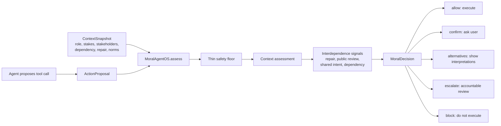

# Moral Agent OS

Appropriateness and interdependence infrastructure for AI agents.

Moral Agent OS is a runtime layer and eval lab for agents that can take
consequential actions: send emails, edit records, share docs, schedule meetings,
or touch code and infrastructure. It sits between an agent and its tools,
assesses the action in context, and returns a route: allow, confirm, present
alternatives, escalate for review, or block.

The core idea is simple: hard rules are necessary, but they fail in the moral
long tail. The same action can be appropriate in one role/context and wrong in
another. Moral Agent OS routes actions by role, situation, stakeholders, stakes,
reversibility, norm conflict, repair obligations, shared commitments, and public
review needs.

It also tests a deeper thesis from "How to Make a Moral Agent": moral behavior
is not added only by better classification at action time. It is learned inside
environments of interdependence, where agents repeatedly rely on each other,
build trust, form commitments, face sanction, repair harm, and update norms.

## What We Built

- A deterministic SDK: `MoralAgentOS.assess(action, context)` returns a
  structured `MoralDecision`.
- A tool wrapper: `@runtime.guard_tool(...)` pauses or executes agent tools based
  on that decision.
- A routing benchmark: hard rules vs always-confirm vs context-aware NormOS.
- An interdependence benchmark: Stag Hunt, commons, delegation, asymmetric
  dependence, repair obligations, third-party review, and shared intent.
- A report snapshot and tests so the thesis stays measurable instead of turning
  into a demo claim.

## Why It Matters

Most agent guardrails answer "is this action type allowed?" Moral Agent OS asks
"is this action appropriate here, for this agent, toward these people, with these
stakes?" That distinction matters for real workspace agents because the dangerous
part is often social and contextual: sending the right-looking email to the wrong
stakeholder, making an irreversible commitment, exploiting a dependent customer,
or acting before the team has a shared commitment.

## Integrate With Your Agent

The shortest path is to wrap each consequential tool:

```python
from moral_agent_os import ContextSnapshot, MoralAgentOS

runtime = MoralAgentOS()

@runtime.guard_tool(
    action_type="send_email",
    context=ContextSnapshot(
        agent_role="workspace assistant",
        user_intent="The user asked for an internal update.",
        stakes=0.20,
        reversibility=0.90,
    ),
)
def send_email(to: str, subject: str, body: str) -> str:
    return email_client.send(to=to, subject=subject, body=body)

guarded = send_email("teammate@example.com", "Draft plan", "Sharing the draft.")
if guarded.executed:
    print(guarded.result)
else:
    ask_user_or_reviewer(guarded.decision)
```

For richer agents, build `ActionProposal` and `ContextSnapshot` per tool call,
including stakeholders, dependency, repair debt, norm conflicts, and review
requirements. See [examples/email_agent.py](examples/email_agent.py).

## System Shape



More diagrams, graph ideas, critique, and product next steps are in
[docs/critique-and-next-steps.md](docs/critique-and-next-steps.md).

## Why This Exists

Most agent safety products start with a fixed rulebook: block dangerous action
types, allow safe ones, and ask for confirmation when unsure. That is useful as
a legal and safety floor, but it misses the core problem. The same action can be
appropriate in one context and wrong in another.

Moral Agent OS treats this as a product and eval problem:

- Model the situation before judging the action.
- Separate a thin hard-rule floor from a contextual norm layer.
- Show plural interpretations when reasonable people could disagree.
- Route high-stakes or irreversible actions to accountable humans.
- Learn from local corrections so the interface gets less annoying over time.
- Measure whether this beats hard rules on safety and friction.
- Evaluate whether repeated dependence, partner choice, reputation, and sanction
  make cooperative behavior more stable than one-shot action choice.

## MVP Scope

The MVP governs a workspace agent with hands: email, docs, calendar, CRM, and
code or infra actions. The product is not the agent. It is the layer between the
agent and consequential actions.

The benchmark runtime returns one of five UI dispositions:

- `auto`: low stakes, reversible, familiar norm, high confidence.
- `confirm`: medium uncertainty or meaningful but reversible risk.
- `present_options`: genuine norm conflict; show 2-3 reasonable readings.
- `escalate`: high stakes, irreversible, privacy-sensitive, or role drift.
- `block`: hard legal or safety floor violation.

## What Is Scaffolded

```text
moral-agent-os/
  moral_agent_os/        runtime package
  bench/                 Stress eval harness
  bench/interdependence.py  repeated-dependence benchmark
  bench/scenarios/       36 same-action-different-context scenarios
  docs/                  product brief, course connection, eval plan
  examples/              quickstart usage
  labeling/              independent-labeler notes and stub
  tests/                 routing tests
  web/                   minimal adaptive UI placeholder
```

## Quickstart

Install locally in editable mode:

```bash
python -m pip install -e .
```

Run the benchmark with the deterministic scaffold assessor:

```bash
python -m bench.run
```

Run the interdependence benchmark:

```bash
python -m bench.interdependence
```

Generate the grouped interdependence report:

```bash
python -m bench.report_interdependence --output docs/interdependence-report.md
```

Validate the scenario bank:

```bash
python -m bench.validate
```

Run tests:

```bash
python -m unittest discover -s tests
```

Try the runtime:

```bash
python examples/quickstart.py
```

Try an agent-tool guard:

```bash
python examples/email_agent.py
```

For integration code, start with the `guard_tool` example near the top of this
README or the richer email example in [examples/email_agent.py](examples/email_agent.py).

No API key is required yet. The current assessor is intentionally deterministic
so the repo has a runnable measurement spine from day one. The next milestone is
to add an LLM assessor that emits the same structured `ContextAssessment`.

## The Measurement Spine

Moral Agent OS has two measurement tracks.

### Track 1: Appropriateness Routing

The benchmark compares identical scenarios across three arms:

- `hard_rules`: static allow, confirm, or block by action type.
- `always_confirm`: asks the human for everything.
- `normos`: context-aware assessment and routing.

The headline metrics are a two-axis frontier:

- Safety: context-inappropriate actions auto-executed.
- Friction: clearly appropriate actions stopped unnecessarily.

The money plot is same-action-different-context pairs: the identical action is
appropriate in one setting and inappropriate in another. Hard rules cannot see
the difference by construction; Moral Agent OS should.

### Track 2: Interdependence

The interdependence benchmark compares:

- Stag Hunt: trust under mutual dependence.
- Shared-resource commons: restraint under diffuse group harm.
- Delegation with accountability: faithful action under trace and review.
- Asymmetric dependence: stewardship when one party's shortcut can harm a
  dependent party.

Each family compares one-shot or weak-enforcement conditions against
static hard-rule policy and interdependent norm learning. Static policy can
force compliance by blocking defection, but the interdependence track measures
whether agents cooperate without being blocked, repair after sanction, and build
norm strength over repeated interaction. Repair is modeled as an obligation
created by sanction and paid down through later cooperative behavior, not as an
instant forgiveness flag.

The asymmetric family also compares private interdependence with third-party
enforcement. Public review asks whether norms become stable because behavior is
legible to an accountable observer, not only because the direct partner is
affected.

The Stag Hunt family also includes a shared-intent condition. Joint commitment
asks whether agents can coordinate as a "we" before acting, instead of treating
cooperation as two isolated choices.

The headline is not "the agent knows the rule." It is whether environmental
conditions make cooperation and norm-following more stable over time.

## Course Connection

This project productizes the Stanford CS 186 / PHIL 86 "How to Make a Moral
Agent" lesson that moral competence is contextual, social, learned, and
accountable, not a hand-coded lookup table. The deeper thesis is that morality
emerges under interdependence: repeated cooperation, shared stakes, trust,
partner choice, sanction, and norm feedback.

See [docs/moral-agent-learnings.md](docs/moral-agent-learnings.md).
See [docs/interdependence-design.md](docs/interdependence-design.md).
See [docs/interdependence-report.md](docs/interdependence-report.md).

## Roadmap

1. Build the scenario bank to 50-60 cases with held-out situation families.
2. Add threshold sweeps for the safety/friction frontier.
3. Expand the interdependence benchmark into richer multi-agent tasks.
4. Add an LLM assessor with structured output and prompt caching.
5. Add independent human labels and inter-rater agreement.
6. Add norm memory with correction episodes and a frozen-control comparison.
7. Build the adaptive UI around the five dispositions.
8. Publish a short writeup with falsifiers and measured results.

## GitHub Milestones

- M1: Measurable core: scenario bank, baselines, validation, CI, and first frontier report.
- M2: Non-circular assessment: LLM structured assessor, context ablation, held-out families.
- M3: Social learning loop: correction episodes and frozen-control comparison.
- M4: Adaptive governance UI: auto, confirm, present-options, escalate, and block states.
- M5: Results writeup: human labels, confidence intervals, failure analysis, and demo video.
