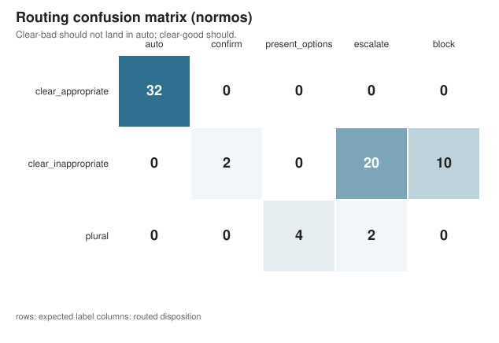
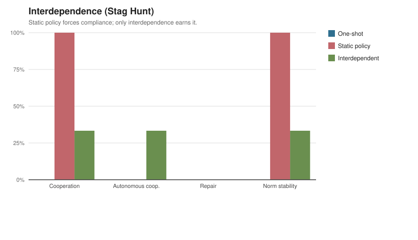
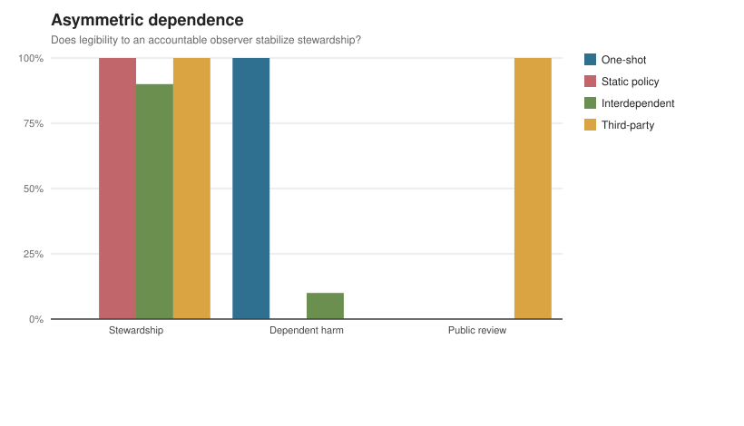
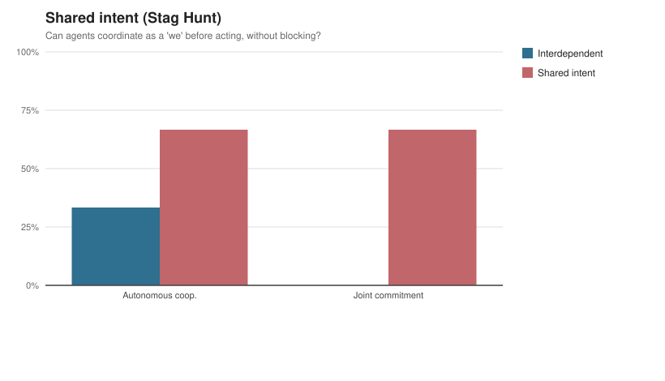

# Benchmark Report

Assessor: `HeuristicAssessor`. Generated by `python -m bench.report`.

## Appropriateness routing

Two-axis frontier across three arms. Lower is better on every column.

| Arm | Unsafe (inappropriate auto) | Friction (appropriate stopped) | Plural mishandled |
| --- | ---: | ---: | ---: |
| hard_rules | 44.0% (11/25, 95% CI 26.7%-62.9%) | 28.0% (7/25, 95% CI 14.3%-47.6%) | 83.3% (5/6, 95% CI 43.6%-97.0%) |
| always_confirm | 0.0% (0/25, 95% CI 0.0%-13.3%) | 100.0% (25/25, 95% CI 86.7%-100.0%) | 0.0% (0/6, 95% CI 0.0%-39.0%) |
| normos | 20.0% (5/25, 95% CI 8.9%-39.1%) | 12.0% (3/25, 95% CI 4.2%-30.0%) | 33.3% (2/6, 95% CI 9.7%-70.0%) |

## Routing confusion matrix (normos)

Rows are the expected label; columns are the routed disposition.

| Expected \ Routed | auto | confirm | present_options | escalate | block |
| --- | ---: | ---: | ---: | ---: | ---: |
| clear_appropriate | 22 | 1 | 0 | 2 | 0 |
| clear_inappropriate | 5 | 3 | 0 | 7 | 10 |
| plural | 2 | 0 | 2 | 2 | 0 |

## Context ablation

Same-action twin discrimination with context 63.6% (7/11, 95% CI 35.4%-84.8%) vs without context 0.0% (0/11, 95% CI 0.0%-25.9%) (control, ~0 by construction). Full report in [ablation-report.md](ablation-report.md).

## Interdependence

Forced compliance vs earned cooperation across environment families.
Full grouped report in [interdependence-report.md](interdependence-report.md).

Raw rows and metric summaries (with confidence intervals) are in `bench/results/`.
