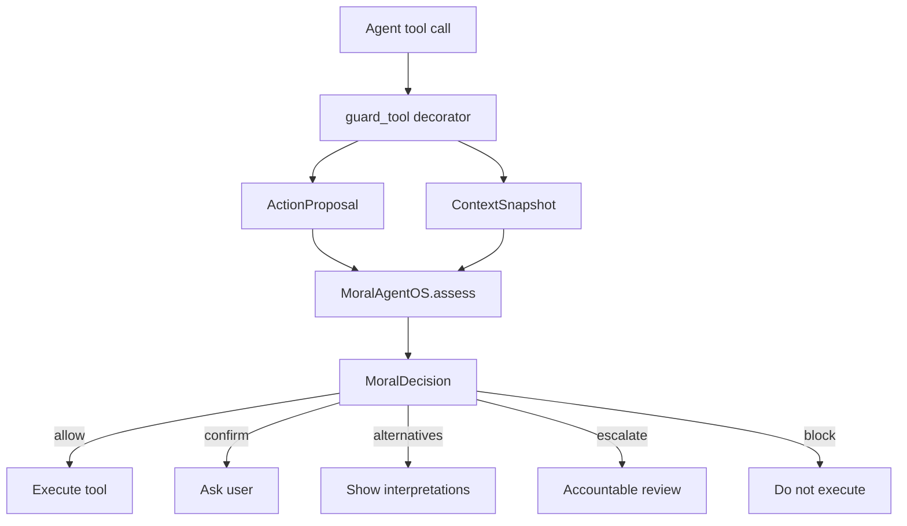
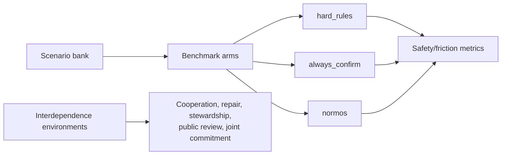

# Critique And Next Steps

## Graphs To Add

The repo should eventually include generated charts, not only textual benchmark
output. The best graphs are:

1. **Safety/friction frontier:** x-axis = unnecessary interventions, y-axis =
   context-inappropriate auto-executes. Plot `hard_rules`, `always_confirm`, and
   `normos`. This is the main "why this is better than rules" graph.
2. **Routing confusion matrix:** expected label vs route. This shows whether the
   runtime blocks clear bad actions, allows clear good actions, and surfaces
   plural cases as alternatives.
3. **Interdependence bar chart:** one-shot vs static policy vs interdependent
   learning across cooperation, autonomous cooperation, repair, and norm
   stability.
4. **Asymmetric dependence chart:** compare one-shot, static policy,
   interdependence, and third-party enforcement on stewardship, dependent harm,
   and public review.
5. **Shared intent chart:** compare Stag Hunt interdependence vs shared intent
   on autonomous cooperation and joint commitment.

## Runtime Diagram

## Evaluation Diagram

## What Is Strong

- The project has a real thesis, not just a generic guardrail: morality requires
  contextual appropriateness plus interdependent social conditions.
- The SDK is now usable: developers can call `assess()` or wrap tools with
  `guard_tool()`.
- The benchmark has falsifiers. Static policy can force compliance, but the
  report separates that from autonomous cooperation, repair, stewardship, public
  review, and shared intent.
- The deterministic scaffold is easy to run locally and in CI, which keeps the
  project legible before adding LLM complexity.

## What Is Weak

- The assessor is still heuristic. It proves the interface and eval structure,
  but not real-world judgment quality.
- The scenario bank is too small for serious claims. Thirty-six scenarios is
  enough for scaffolding, not enough for external confidence.
- The interdependence simulator is illustrative, not scientific. Its numbers are
  useful for product thinking but should not be presented as empirical proof.
- The SDK has no persistence yet. Repair obligations, local norms, and review
  history currently have to be passed into `ContextSnapshot` manually.
- The guard decorator does not yet integrate with a real agent framework such as
  LangChain, OpenAI tool calling, CrewAI, AutoGen, or a custom MCP server.

## Product Next Steps

1. **Generated reports:** add a script that writes CSV/Markdown/PNG-style chart
   artifacts from `bench.run` and `bench.interdependence`.
2. **Persistent norm memory:** store corrections, repair obligations, trust, and
   review history per stakeholder or workspace.
3. **Tool adapters:** add examples for `send_email`, `share_doc`, `update_crm`,
   `schedule_meeting`, and `run_code`.
4. **LLM assessor interface:** keep the deterministic assessor as the baseline,
   then add a structured LLM assessor that emits the same schema.
5. **Human-label workflow:** expand to 50-60 scenarios, add independent labels,
   and report inter-rater agreement.
6. **Review queue UI:** build a simple reviewer surface for escalated decisions.
7. **Agent-framework integrations:** provide wrappers for common tool-calling
   patterns so users can adopt the SDK without redesigning their agents.

## Near-Term Build Order

1. Add `bench/report.py` to generate a compact Markdown report for the
   safety/friction benchmark.
2. Add CSV outputs for both benchmark tracks.
3. Add a `docs/figures/` placeholder and generated Mermaid or text chart
   snapshots.
4. Add `moral_agent_os/memory.py` persistence for local norm and relationship
   state.
5. Add a second example agent with two tools: `share_doc` and `schedule_meeting`.
