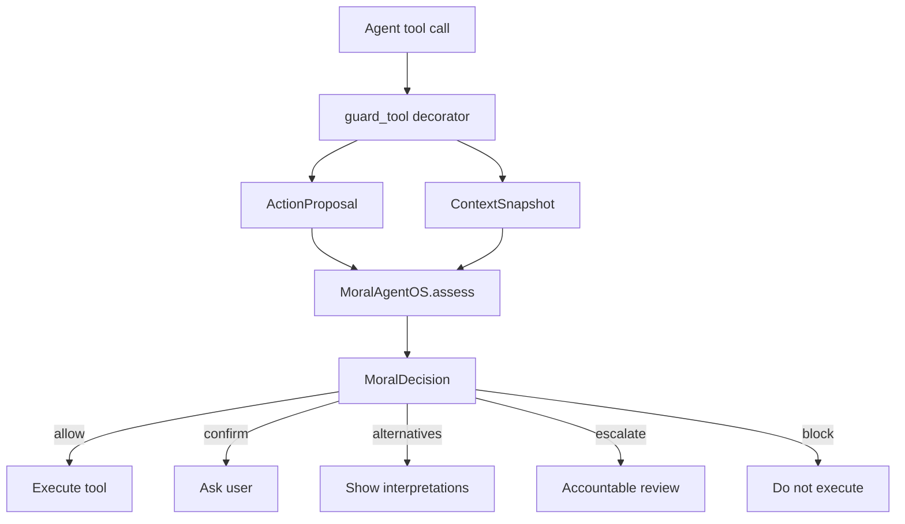
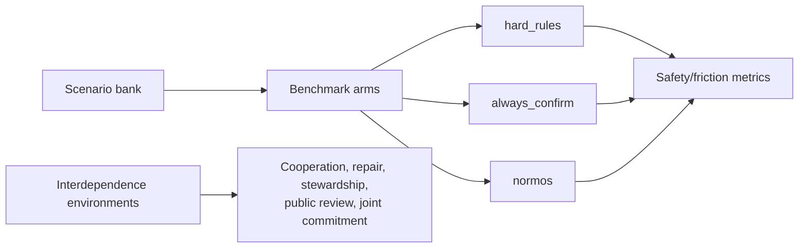

# Critique And Next Steps

## Graphs To Add

The repo should eventually include generated charts, not only textual benchmark
output. The best graphs are:

1. **Safety/friction frontier:** x-axis = unnecessary interventions, y-axis =
   context-inappropriate auto-executes. Plot `hard_rules`, `always_confirm`, and
   `normos`. This is the main "why this is better than rules" graph.
2. **Routing confusion matrix:** expected label vs route. This shows whether the
   runtime blocks clear bad actions, allows clear good actions, and surfaces
   plural cases as alternatives.
3. **Interdependence bar chart:** one-shot vs static policy vs interdependent
   learning across cooperation, autonomous cooperation, repair, and norm
   stability.
4. **Asymmetric dependence chart:** compare one-shot, static policy,
   interdependence, and third-party enforcement on stewardship, dependent harm,
   and public review.
5. **Shared intent chart:** compare Stag Hunt interdependence vs shared intent
   on autonomous cooperation and joint commitment.

## Runtime Diagram

## Evaluation Diagram

## What Is Strong

- The project has a real thesis, not just a generic guardrail: morality requires
  contextual appropriateness plus interdependent social conditions.
- The SDK is now usable: developers can call `assess()` or wrap tools with
  `guard_tool()`.
- The benchmark has falsifiers. Static policy can force compliance, but the
  report separates that from autonomous cooperation, repair, stewardship, public
  review, and shared intent.
- The deterministic scaffold is easy to run locally and in CI, which keeps the
  project legible before adding LLM complexity.

## What Is Weak

- The default assessor is heuristic. An LLM assessor now exists and emits the same schema,
  but the headline numbers are produced with the deterministic baseline unless a key is
  supplied, and the LLM's judgment quality has not been measured at scale yet.
- [improved] The scenario bank grew to 70, including 18 same-action twins and held-out
  cases. Model-rater agreement is now reported; independent human labels remain open.
- The interdependence simulator is illustrative, not scientific. Its numbers are
  useful for product thinking but should not be presented as empirical proof.
- [addressed] The SDK now persists corrections, repair obligations, trust, and review
  history via `WorkspaceMemory`; `hydrate_context` fills a `ContextSnapshot` from storage.
- [addressed] The guard now integrates with LangChain, CrewAI, AutoGen, and OpenAI
  Agents-style tools through `ai_safety_os.adapters`.

## Product Next Steps

1. **Fresh LLM validation:** rerun OpenRouter/LLM validation on the 70-scenario
   bank, using leave-one-model-out consensus when the assessor overlaps a rater.
2. **Human-label workflow:** recruit independent human labels and report agreement
   against both author labels and model-rater consensus.
3. **Review queue UI:** build a simple reviewer surface for escalated decisions,
   using `required_review` and structured `alternatives`.
4. **Multi-tool examples:** add `share_doc`, `update_crm`, `schedule_meeting`,
   and `run_code` examples with persistent workspace memory.
5. **Production adapters:** test installed-framework behavior with real optional
   dependencies and add async tool support.

## Near-Term Build Order

1. [done] `bench/report.py` generates Markdown, CSV, and JSON for the safety/friction
   benchmark, plus the confusion matrix.
2. [done] CSV and JSON outputs for both benchmark tracks in `bench/results/`.
3. [done] `docs/figures/` holds generated SVG charts (frontier, confusion matrix,
   interdependence, asymmetric, shared intent, ablation, memory).
4. [done] `ai_safety_os/memory.py` persists corrections, relationships, and review
   history, with a frozen-control comparison in `bench/memory_demo.py`.
5. [done] Tool adapters for LangChain, CrewAI, AutoGen, and OpenAI Agents in
   `ai_safety_os.adapters`,
   with a runnable example. (A second multi-tool example agent is still a nice-to-have.)

## Built Since This Critique

- An LLM contextual assessor (`ai_safety_os/llm_assessor.py`) emitting the same schema.
- A context-ablation experiment (`bench/ablation.py`) that measures whether the
  same-action win is real or definitional, with the scenario bank grown to 70 including
  18 same-action twins and held-out, out-of-vocabulary cases.
- A stronger `high_risk_policy` static baseline that is safer than naive hard rules
  but substantially more annoying, making the safety/friction tradeoff more honest.

Fresh 70-scenario LLM validation and independent human labels remain open and are stated
honestly in the README.
