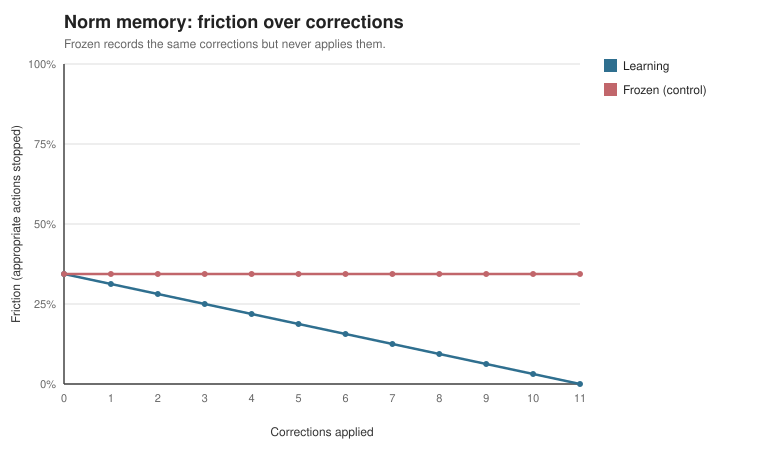

# Norm-Memory Frozen Control

Does persisting corrections reduce friction without reducing safety? This compares
a learning workspace against a frozen control that records the same corrections but
never applies them.

Appropriate actions: 32. Of these, the base router over-confirms 4 (the recurring situations a human corrects).

## Friction over corrections

| Workspace | Friction before | Friction after all corrections |
| --- | ---: | ---: |
| Learning | 12.5% | 6.2% |
| Frozen (control) | 12.5% | 12.5% |

## Safety check

Corrections were recorded only on appropriate actions, so inappropriate auto-execute
rate must not rise. Nearest-neighbor retrieval could over-generalize; the control is
what would make that visible.

| Workspace | Inappropriate auto-executed |
| --- | ---: |
| Base (no memory) | 37.5% |
| Learning | 37.5% |
| Frozen (control) | 37.5% |

Learning reduces friction while the frozen control stays flat, and inappropriate auto-execution does not rise. The persistence loop helps without trading away safety on this bank.
